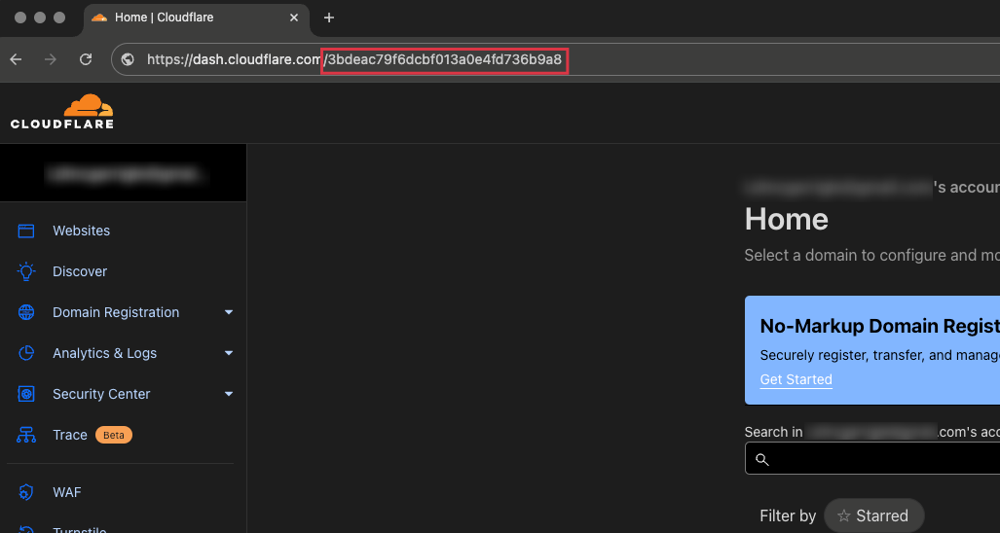

# How to use

Just run the command 
```
curl -sSL https://raw.githubusercontent.com/liamdmcgarrigle/n8n-auto-install/main/install.sh | bash && bash n8n-auto-install/setup.sh
```

Then you will just need to answer the questions that are prompted

## Quick Example Video
https://youtu.be/RlEwZ9xWLpk


## What it does

> ⚠️  This is a quick and dirty solution. It is essentially copy and pasting config files, but based on your answers. Any maintenance or updates will need to be done manually. I show simple examples of that in this readme.

1. downloads dependencies (if they aren't already installed)
    - python
    - python3-ven
    - pip
    - git
    - docker
2. Clones this github repo to your system
3. Generates an `/n8n` folder with `docker-compose.yaml`, `.env`, and a `dockerfile` based on your inputs.
4. Starts the docker container (and builds first if needed)
5. Automatically sets up a Cloudflare tunnel and sets Cloudflare DNS records with your Cloudflare token (if you select that option)
6. Deletes itself from your machine

# Supported OS
This script supports all Linux distros supported with the [official install script](https://github.com/docker/docker-install). This does not support Windows or Mac. If using Windows, run on WSL (though i did not test there).

It would be very easy to add mac support, the only unsupported command is running docker with sudo. If you would like mac support let me know

# Cloudflare Tunnel Required Info
1. Your domain needs to be managed on Cloudflare
It does not need to be registered there, just managed. It is free.

2. Create an API Token
Go to [https://dash.cloudflare.com/profile/api-tokens](https://dash.cloudflare.com/profile/api-tokens) to create a token. You need the `Cloudflare Tunnel:Edit` and `DNS:Edit` scopes.

3. Get Account ID
Go to [your CloudFlare Dashboard](https://dash.cloudflare.com/). The ID in the URL is your account ID.




# Maintenance and Trouble Shooting
You will need to manually interact with the commandline to update your instance in the future or to troubleshoot setup issues.

If there is an error during setup, you may need to delete the files and folders it created before trying again or it might cause more errors.

## If there is an error or you need to correct a wrong input
1. if needed, stop the script with `ctrl c`
2. remove the folders the script created using the commands explained below
   - it makes a folder named `n8n` and `n8n-auto-install`
3. rerun the command

## If you are having problems with data not saving after a restart
The first deployment of this had a fatal error that caused data not to save. 
The env variable `N8N_USER_FOLDER` had the wrong default value in the original version of the script.

I don't think this will effect anyones production instances, but if it does, back up your workflows before restarting your instance because you WILL lose eveything (if you used this script before Aug/24/2024)

## Commands you need to know
### `cd`
`cd` is to change directory. If you are at the root of your system, and you have a folder named `/n8n`, you can go to that folder with `cd n8n`. Then to go back, you can run `cd ..`. A `.` brings you back in the file system.

Your current directory is shown to the left of your command input, with a `~` notating the root.

### `ls` and `ls -a`
`ls` lists files and `ls -a` lists files including hidden files (files and folders starting with a `.` are hidden, like the `.env` file). 

### `rm` & `rm -r`
These are commands to delete files and folders. 
If you are in a directory that has a file called `dockerfile` in it, you can run `rm dockerfile` and it will delete.
If you want to delete a folder with the items inside of it you can run `rm -rf folder-name`. 

### `nano`
This command opens a text editor for a file. 
If you are in a directory that has a file called `.env` in it, you can run `nano .env` and it will open.
From there you can edit the values in the .env file, which is where all the options during this proccess save, and then can save it following instructions on screen

### `docker compose down` & `docker compose up -d`
These commands start and stop your n8n docker container. You need to be in the n8n directory with the `docker-compose.yaml` file.
